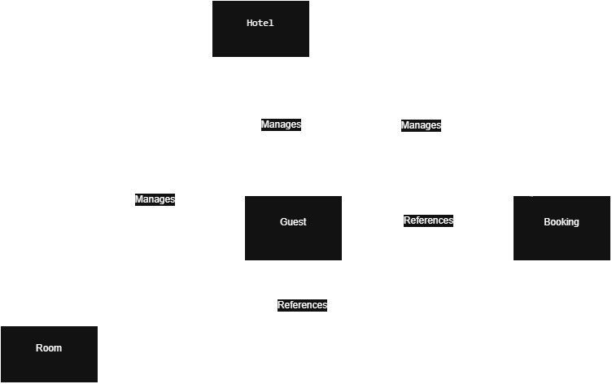

# Class Design Document

## Team Members
-Larvine Mutuku 
-Susan Njeri
-Yusra Haruna
-Hazel Awino

## Selected Project
Project 4 – Hotel Guest Check-In & Room Booking System

---

## Class 1: Room
**Owner:** [Rooms person's name]

**Purpose:** Represents a single hotel room and tracks its availability status.

### Attributes
| Attribute | Data Type | Description |
|---|---|---|
| room_number | str | Unique identifier for the room |
| room_type | str | Category of room, e.g. Single, Double, Suite |
| price_per_night | float | Cost to stay one night in this room |
| status | str | Current state: "Available", "Booked", or "Occupied" |

### Methods
| Method | Parameters | Purpose |
|---|---|---|
| `__init__` | room_number, room_type, price_per_night, status | Creates a new Room object and validates the input |
| `is_available` | none | Returns True if the room's status is "Available" |
| `display_details` | none | Prints the room's information to the screen |
| `to_file_line` | none | Converts the room's data into a line of text for saving to a file |
| `from_file_line` | line (str) | Rebuilds a Room object from a saved line of text |

*(Rooms owner: add any extra methods/attributes you introduce, e.g. max_occupancy, and describe them here.)*

---

## Class 2: Guest
**Owner:** [Yusra Haruna]

**Purpose:** Represents a hotel guest and their contact details.

### Attributes
| Attribute | Data Type | Description |
|---|---|---|
| guest_id | str | Unique identifier for the guest |
| name | str | Guest's full name |
| phone | str | Guest's contact phone number |
| email | str | Guest's contact email address |

### Methods
| Method | Parameters | Purpose |
|---|---|---|
| `__init__` | guest_id, name, phone, email | Creates a new Guest object and validates the input |
| `display_details` | none | Prints the guest's information to the screen |
| `to_file_line` | none | Converts the guest's data into a line of text for saving to a file |
| `from_file_line` | line (str) | Rebuilds a Guest object from a saved line of text |

**Validation added in `__init__`:**
- guest_id cannot be empty
- name cannot be empty
- phone cannot be empty and must contain digits only
- email cannot be empty and must contain "@"

All validation failures raise `ValueError` with a specific message, caught and displayed by `register_guest_menu` in `main.py`.

## Class 3: Booking
**Owner:** [Bookings person's name]

**Purpose:** Links a Guest to a Room for a given date range and tracks the booking's status.

### Attributes
| Attribute | Data Type | Description |
|---|---|---|
| booking_id | str | Unique identifier for the booking |
| guest_id | str | ID of the guest who made the booking |
| room_number | str | Number of the room being booked |
| check_in_date | str | Planned/actual check-in date (YYYY-MM-DD) |
| check_out_date | str | Planned/actual check-out date (YYYY-MM-DD) |
| status | str | Current state: "Booked", "Checked-In", or "Checked-Out" |

### Methods
| Method | Parameters | Purpose |
|---|---|---|
| `__init__` | booking_id, guest_id, room_number, check_in_date, check_out_date, status | Creates a new Booking object |
| `calculate_total_cost` | price_per_night | Calculates the number of nights and returns the total stay cost |
| `display_details` | none | Prints the booking's information to the screen |
| `to_file_line` | none | Converts the booking's data into a line of text for saving to a file |
| `from_file_line` | line (str) | Rebuilds a Booking object from a saved line of text |

*(Bookings owner: add any extra methods/attributes you introduce here.)*

---

## Class 4: Hotel
**Owner:** Larvine Mutuku

**Purpose:** The central manager class. Holds all rooms, guests, and bookings, applies business rules (e.g. preventing double-booking), and handles saving/loading all data to and from files.

### Attributes
| Attribute | Data Type | Description |
|---|---|---|
| rooms | list of Room | All rooms in the hotel |
| guests | list of Guest | All registered guests |
| bookings | list of Booking | All bookings made |

### Methods
| Method | Parameters | Purpose |
|---|---|---|
| `__init__` | none | Initialises empty lists and loads any previously saved data |
| `add_room` | room | Adds a new room, prevents duplicate room numbers |
| `display_all_rooms` | none | Prints every room |
| `display_available_rooms` | none | Prints only rooms with status "Available" |
| `find_room` | room_number | Returns the Room object matching the given number, or None |
| `register_guest` | guest | Adds a new guest, prevents duplicate guest IDs |
| `search_guest` | guest_id | Returns the Guest object matching the given ID, or None |
| `create_booking` | booking_id, guest_id, room_number, check_in, check_out | Validates room availability and guest existence, then creates a Booking and marks the room "Booked" |
| `display_bookings` | none | Prints every booking |
| `find_booking` | booking_id | Returns the Booking object matching the given ID, or None |
| `check_in` | booking_id | Marks a booking as "Checked-In" and the room as "Occupied" |
| `check_out` | booking_id | Calculates total cost, marks booking "Checked-Out", frees the room |
| `save_all` | none | Writes all rooms, guests, and bookings to their data files |
| `load_all` | none | Reads all rooms, guests, and bookings from their data files on startup |

*(Check-in/out owner: add any extra methods/attributes you introduce here.)*

---

## Class Diagram
*
- Hotel → manages → Room
- Hotel → manages → Room
- Hotel → manages → Guest
- Hotel → manages → Booking
- Booking → references → Room
- Booking → references → Guest
